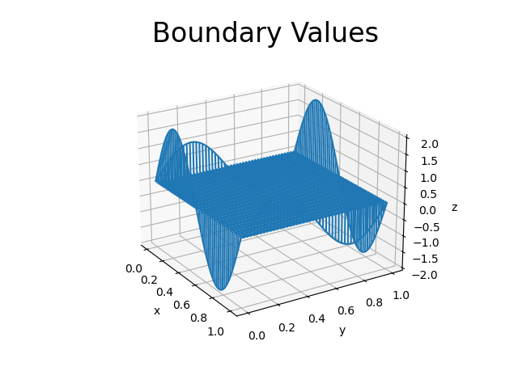
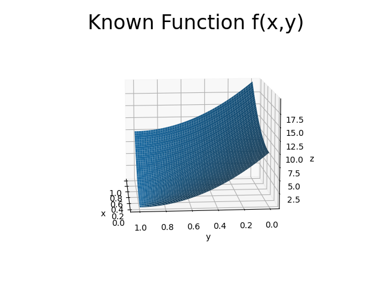
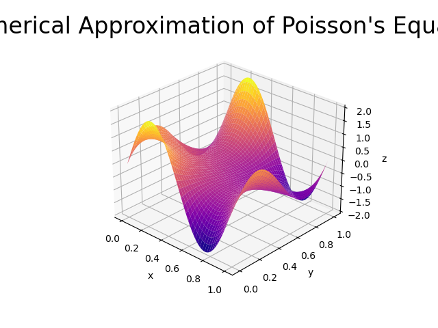
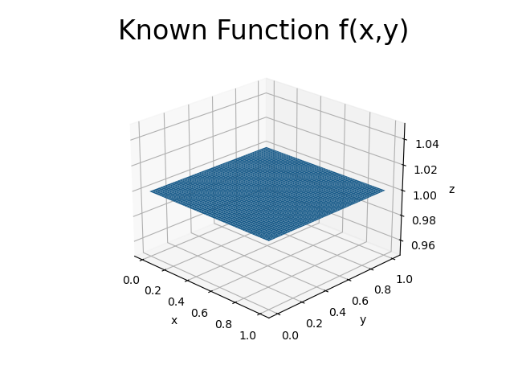
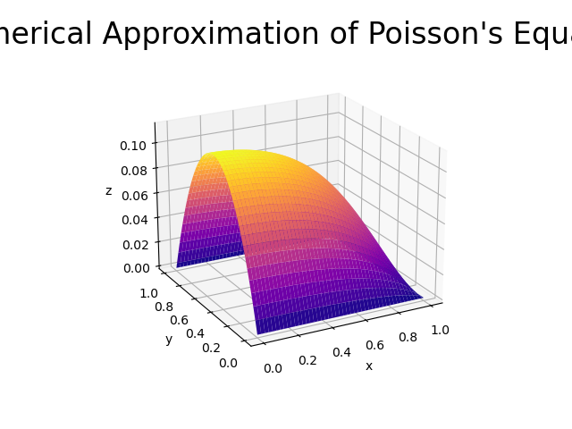
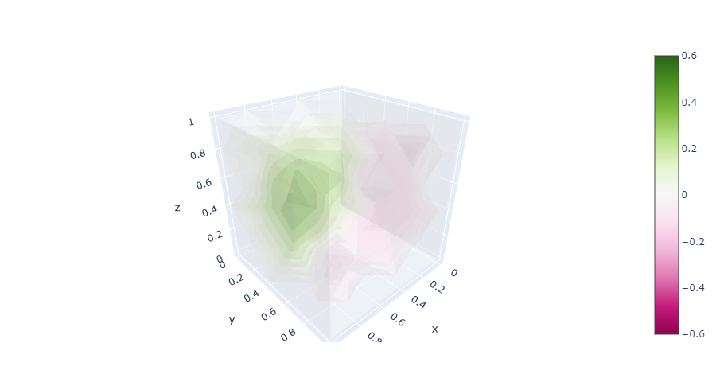
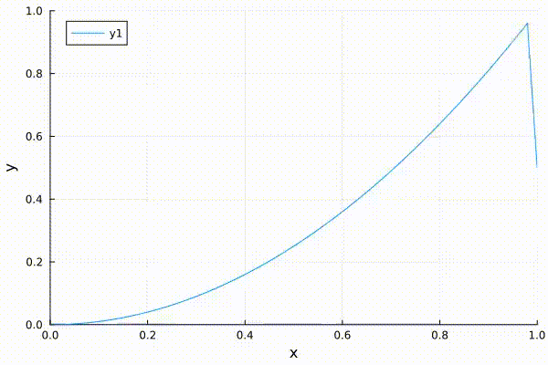
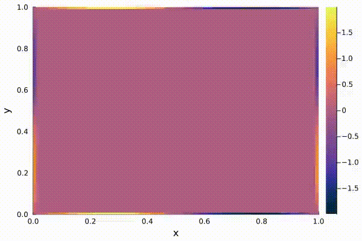

# Numerical Solutions for Poisson's Equation in 1D, 2D, 3D using the Finite Difference Method

This repository contains the code to numerically solve and visualize Poisson's Equation in 1D, 2D, and 3D with Dirichlet and Neumann Boundary Conditions using the Finite Difference Method.


## Table of Contents

- [Introduction](#introduction)
- [Files](#files)
- [Dependencies](#dependencies)
- [Usage](#usage)
- [Results](#results)
- [Contributing](#contributing)
- [License](#license)
- [Author](#author)

## Introduction

Poisson's Equation is a partial differential equation that appears in various fields of science and engineering. This repository provides Julia code to numerically solve Poisson's Equation in 1D, 2D, and 3D using the Finite Difference Method. The method is based on approximating derivatives with Taylor Series to obtain numerical solutions.

## Files

The repository contains the following Julia files:

- `1D_BF.jl`: Numerical solution in 1D with Fixed Boundary Condition
- `1D_NBC_2O.jl`: Numerical solution in 1D with Neumann Boundary Condition (2nd Order)
- `2D_BF.jl`: Numerical solution in 2D with Fixed Boundary Condition
- `2D_NBC_2O.jl`: Numerical solution in 2D with Neumann Boundary Condition (2nd Order)
- `3D_BF.jl`: Numerical solution in 3D with Fixed Boundary Condition
- `MorePDEs`: Additional numerical solutions of other PDEs (Heat equation, Wave equation)

## Dependencies

To run this code, you will need to have Julia installed on your PC. You can download it [here](https://julialang.org/downloads/).

The code relies on the following Julia packages, which can be installed using the Julia terminal:

```Julia
using Pkg
Pkg.add("SparseArrays")
Pkg.add("LinearAlgebra")
Pkg.add("PyPlot")
Pkg.add("PlotlyJS")
```

## Usage

To execute any file, use the following command in the terminal:

```bash
julia /path/to/file.jl
```

## Results

### 2D Poisson's Equation (Dirichlet Boundary Condition)

Poisson's Equation in 2D with Dirichlet Boundary Condition is given by:

```math
\frac{\partial^2 u}{\partial x^2} + \frac{\partial^2 u}{\partial y^2} = f(x,y)
```

Boundary Condition:



Function that we are solving for:

```math
f(x,y) = 10(x^2 + y^2)
```

Known Function:



Numerical Solution:



### 2D Poisson's Equation (Neumann Boundary Condition)

Poisson's Equation in 2D with Neumann Boundary Condition is given by:

```math
\frac{\partial^2 u}{\partial x^2} + \frac{\partial^2 u}{\partial y^2} = f(x,y)
```

Boundary Condition:

```math
\frac{\partial u(0,y)}{\partial y} = 0
```

Function that we are solving for:

```math
f(x,y) = 1
```

Known Function:



Numerical Solution:



### 3D Poisson's Equation (Dirichlet Boundary Condition)

Poisson's Equation in 3D with Dirichlet Boundary Condition is given by:

```math
\nabla^2 u = f(x,y,z)
```

Boundary Condition:

```math
All boundaries = 0
```

Function that we are solving for:

```math
f(x,y,z) = x^2 + 0.4
```

Known Function:


Numerical Solution:




# Other PDEs
### 1D Wave Equation

The 1D Wave Equation is given by:

```math
\frac{\partial^2 u}{\partial t^2} = c^2 \frac{\partial^2u}{\partial x^2}
```

Analytical Solution:


Numerical Solution:


Solution Error:


### 1D Heat Equation

The 1D Heat Equation is given by:

```math
\frac{\partial u}{\partial t} = D^2 \frac{\partial^2u}{\partial x^2}
```

Fixed Boundary Condition:



Neumann Boundary Condition:


### 2D Heat Equation

The 2D Heat Equation is given by:

```math
\frac{\partial u}{\partial t} = D^2 \nabla^2 u
```

Fixed Boundary Condition:


Numerical Solution:




## Contributing

Contributions are welcome! If you find any bugs, have suggestions for improvements, or want to add new PDE examples, please create a pull request or submit an issue. Your contributions and feedback are greatly appreciated!

## License

This project is licensed under the MIT License - see the [LICENSE](LICENSE) file for details.


## Author


Marti Jimenez: [@Marti2405](https://github.com/Marti2405)

